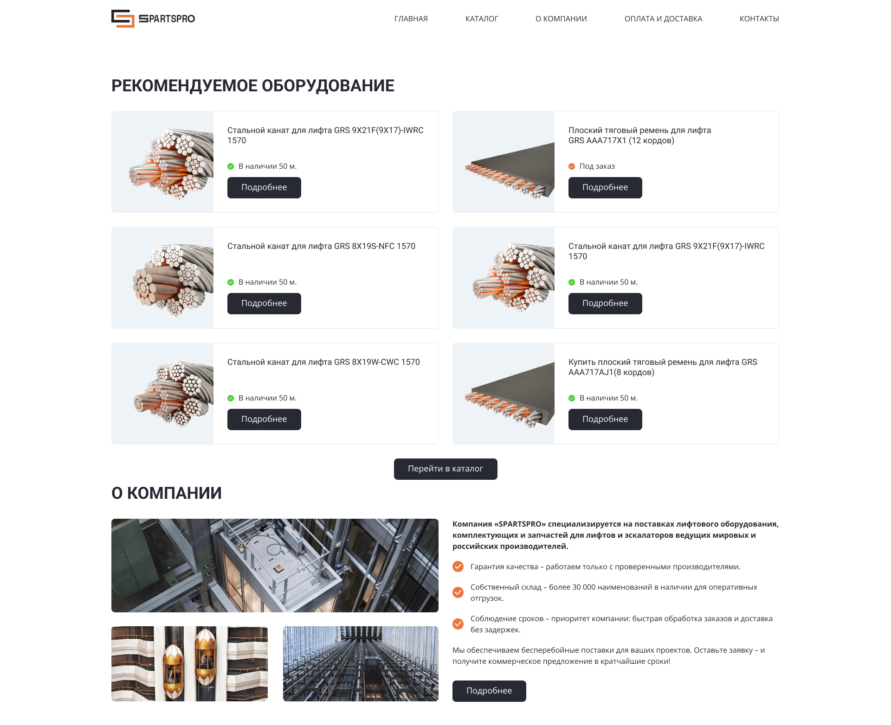

# Тестовое задание для Van Gogh-Link

[Ссылка на GitHub Pages](https://yaroslav-chertov.github.io/spartspro/)

[Ссылка на макет Figma](https://www.figma.com/design/rzc7AEVaSazZByhZ19GEwC/%D0%A2%D0%B5%D1%81%D1%82%D0%BE%D0%B2%D0%BE%D0%B5-%D0%B7%D0%B0%D0%B4%D0%B0%D0%BD%D0%B8%D0%B5?node-id=0-1&p=f&t=TntXSemAhHEwDSfb-0)

## Описание и функциональность

Одностраничный адаптивный сайт выполненный в рамках тестовго задание строго по макету и тз.



Функционал и технологии:

-   Адаптивный верстка для экранов популярных разрешений;
-   Расширинный функционал Html и CSS (Grid Layout, Flexbox).
-   БЭМ методология, файловая структура (Nested);
-   Vanilla JS.

## Инструкция по установке:

```
git clone https://github.com/Yaroslav-Chertov/russian-travel.git
```

Затем запустить локальный сервер.

## Планы по доработке (не в рамках тестового задания)

Функционал и технологии:

-   Получать товары и остальной контент (тексты, картинки и тд) по API;
-   Перевести стили на SCSS с использованием миксинов и переменных;
-   Добавить анимации появления элементов при скролле (Intersection Observer / AOS.js);
-   Реализовать плавную прокрутку и "scroll to top" кнопку;
-   Оптимизировать изображения и настроить lazy-loading для картинок;
-   Сделать форму обратной связи с валидацией на JS;
-   Добавить компонентный подход (например, с помощью Vite + Pug/Handlebars или React для переиспользуемости блоков);
-   Настроить ESLint + Prettier для единого код-стайла.
